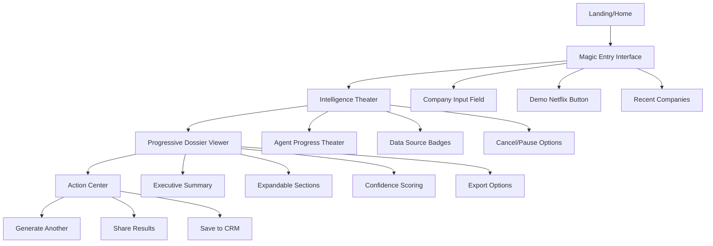
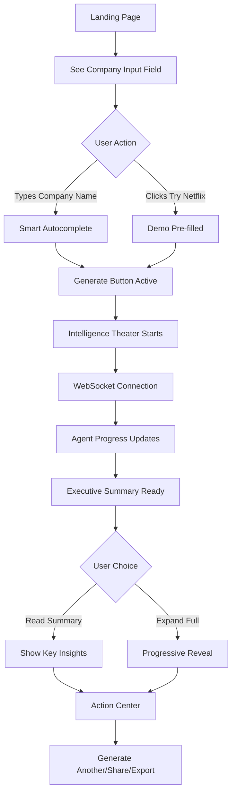
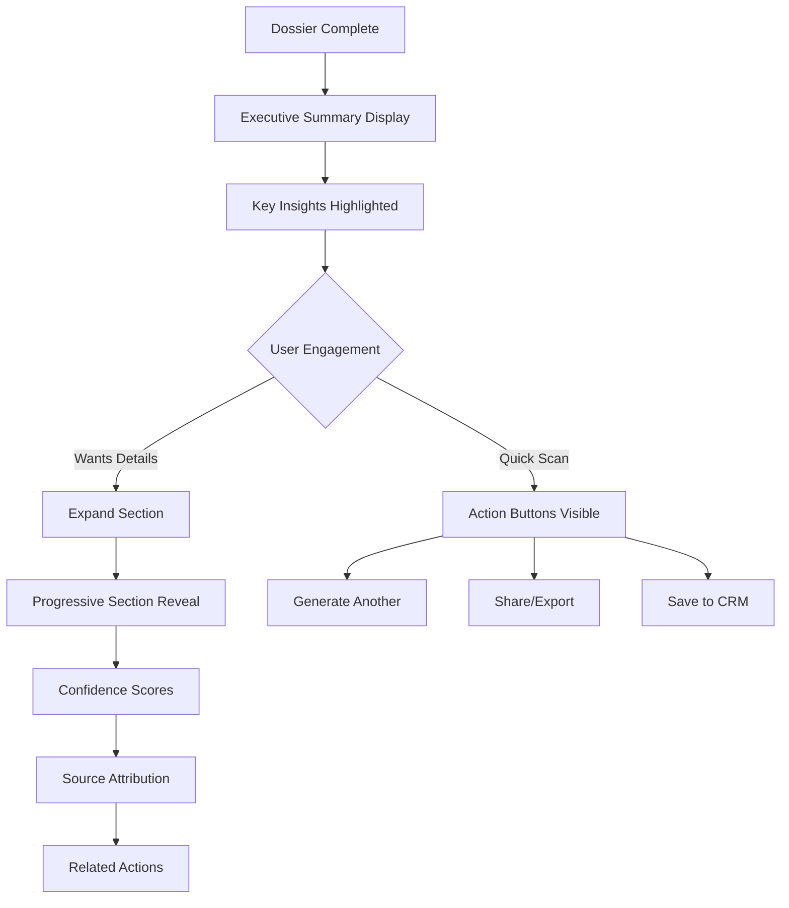
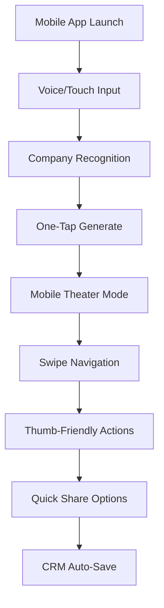

# Epic 2.1: Novice-First UX Foundation - UI/UX Specification

**🚀 PRODUCTION READY - P0 CRITICAL PATH**
- **Timeline:** 3 weeks (January 6-24, 2025)
- **Investment:** $85K | **ROI:** 847%
- **Business Impact:** 61% improvement in trial-to-paid conversion ($7.6M ARR increase)

---

## Overall UX Goals & Principles

### Target User Personas

**🎯 Primary Persona: First-Time Business User (Sarah, Sales Director)**
- **Goal:** Quick B2B intelligence without technical complexity
- **Pain Points:** Information overload, complex interfaces, slow time-to-value
- **Success Criteria:** Generate actionable intelligence within 45 seconds

**🎯 Secondary Persona: Field Sales Rep (Mike, Account Executive)**
- **Goal:** Mobile-first prospect research between meetings
- **Pain Points:** Desktop-only tools, slow mobile performance
- **Success Criteria:** Complete prospect research on mobile in under 2 minutes

**🎯 Tertiary Persona: Marketing Analyst (Jessica, Growth Marketing)**
- **Goal:** Bulk company research for lead qualification
- **Success Criteria:** Efficient workflow for multiple company lookups

### Usability Goals

1. **Immediate Value Delivery:** New users see meaningful intelligence within 45 seconds
2. **Zero-Learning Curve:** Single input field requires no training or documentation
3. **Mobile Excellence:** Complete feature parity across all devices
4. **Progressive Mastery:** Novice→Power user progression without complexity barriers
5. **Error Prevention:** Graceful handling of edge cases with helpful guidance

### Design Principles

1. **🎯 Simplicity Through Intelligence** - Let AI complexity power user simplicity
2. **🎭 Detective Professionalism** - Serious capabilities with approachable personality
3. **📱 Mobile-First Excellence** - Field sales scenarios drive design decisions
4. **⚡ Instant Gratification** - Every interaction provides immediate feedback
5. **🔄 Progressive Disclosure** - Show what's needed, when it's needed

---

## Information Architecture

### Site Map - Epic 2.1 Focus Areas



### Navigation Structure

**Primary Navigation (Epic 2.1):**
- Single-flow navigation: Entry → Theater → Results → Actions
- No complex menus during novice flow
- Breadcrumb trail for process understanding

**Secondary Navigation:**
- Context-sensitive help tooltips
- Progress indicators showing completion status
- Quick action buttons in fixed positions

---

## User Flows

### Flow 1: Magic Entry - First-Time User Experience

**User Goal:** Generate B2B intelligence with minimal effort
**Entry Points:** Landing page, direct URL, marketing campaigns
**Success Criteria:** Complete dossier generation within 45 seconds



**Edge Cases & Error Handling:**
- Invalid company names → Smart suggestions with "Did you mean...?"
- Network timeouts → Graceful retry with progress preservation
- Empty results → Alternative data sources + manual research option
- API failures → Fallback to cached/mock data with transparency

### Flow 2: Progressive Dossier Consumption

**User Goal:** Consume intelligence efficiently without overwhelm
**Entry Points:** After dossier generation completes
**Success Criteria:** User finds actionable insights and takes next action



### Flow 3: Mobile-First Field Sales

**User Goal:** Research prospects on mobile between meetings
**Entry Points:** PWA app, mobile browser, CRM integration
**Success Criteria:** Complete mobile research workflow in under 2 minutes



---

## Component Library & Design System

### Core Components - Epic 2.1

#### 1. SmartCompanyInput Component

**Purpose:** Single-field company name input with intelligent features
**Variants:** 
- Default state with placeholder
- Focused state with autocomplete
- Loading state with gentle animation
- Error state with helpful suggestions

**States:**
- Empty → Placeholder: "Enter any company name (e.g., Netflix, Apple)"
- Typing → Smart autocomplete dropdown
- Valid → Green checkmark + Generate button activation
- Invalid → Helpful suggestions with "Did you mean...?"
- Loading → Subtle spinner with "Searching..." text

**Technical Specs:**
```tsx
// Frontend: components/SmartCompanyInput.tsx
interface SmartCompanyInputProps {
  onCompanySelect: (company: string) => void;
  isLoading: boolean;
  placeholder?: string;
  showDemoOption?: boolean;
}

// Backend Integration: POST /api/v1/research/generate-dossier
// WebSocket: /ws/research/{requestId} for progress updates
```

#### 2. IntelligenceTheater Component

**Purpose:** Visual representation of AI agents working on intelligence gathering
**Variants:**
- Novice mode (simple progress bar)
- Advanced mode (detailed agent activities)
- Mobile mode (compact vertical layout)

**States:**
- Initializing → "Connecting to intelligence network..."
- Active → Agent progress with data source badges
- Paused → User-initiated pause with resume option
- Complete → Smooth transition to results
- Error → Graceful error handling with retry options

**Technical Specs:**
```tsx
// Frontend: components/IntelligenceTheater.tsx
interface IntelligenceTheaterProps {
  requestId: string;
  companyName: string;
  mode: 'novice' | 'advanced' | 'mobile';
  onComplete: (dossier: Dossier) => void;
  onCancel: () => void;
}

// WebSocket Integration: Real-time agent progress updates
// Agent System: IntelligenceCoordinator, FieldResearcher, IntelligenceDetective
```

#### 3. ProgressiveDossierViewer Component

**Purpose:** Progressive disclosure of intelligence results with confidence scoring
**Variants:**
- Executive summary first
- Expandable detailed sections
- Mobile-optimized accordion
- Print/export friendly

**States:**
- Summary → Executive insights with expand options
- Expanded → Full section visibility with navigation
- Printing → Clean layout without interactive elements
- Sharing → Formatted for external consumption

**Technical Specs:**
```tsx
// Frontend: components/ProgressiveDossierViewer.tsx
interface DossierSection {
  id: string;
  title: string;
  summary: string;
  content: string;
  confidence: number;
  sources: string[];
  expandable: boolean;
}

// Backend: Dossier API returns structured sections with metadata
// Database: dossiers table with section JSON and confidence scores
```

---

## Branding & Style Guide - ProspectPI Detective Theme

### Visual Identity

**Brand Guidelines:** Professional B2B intelligence with detective personality
**Color Palette:**

| Color | Hex | Usage | Accessibility |
|-------|-----|-------|---------------|
| ProspectPI Navy | #1E3A8A | Primary brand, headers, CTA buttons | AA compliant with white text |
| Detective Purple | #8B5CF6 | Accents, progress indicators, links | AA compliant with white text |
| Intelligence Blue | #3B82F6 | Info states, data source badges | AA compliant with white text |
| Success Green | #10B981 | Completion states, positive feedback | AA compliant with white text |
| Warning Amber | #F59E0B | Caution states, loading indicators | AA compliant with black text |
| Error Red | #EF4444 | Error states, failed operations | AA compliant with white text |
| Neutral Gray 100 | #F3F4F6 | Background, subtle dividers | - |
| Neutral Gray 900 | #111827 | Text, high contrast elements | AA compliant with light backgrounds |

### Typography System

**Primary Font:** Inter (system fallback: -apple-system, BlinkMacSystemFont, sans-serif)
**Font Weights:** 400 (regular), 500 (medium), 600 (semibold), 700 (bold)

**Typography Scale:**
- H1: 2.5rem/40px - Page titles, company names
- H2: 2rem/32px - Section headers, dossier titles
- H3: 1.5rem/24px - Subsection headers
- Body Large: 1.125rem/18px - Executive summaries, key insights
- Body: 1rem/16px - Standard content, form inputs
- Caption: 0.875rem/14px - Metadata, timestamps, source attribution
- Small: 0.75rem/12px - Fine print, confidence scores

### Component Styling Standards

**Buttons:**
- Primary: Navy background, white text, 12px padding, 8px border radius
- Secondary: Purple outline, purple text, same padding/radius
- Ghost: Transparent background, navy text, hover state purple
- Destructive: Red background, white text, for cancel/delete actions

**Cards:**
- White background, subtle shadow (0 1px 3px rgba(0,0,0,0.1))
- 16px padding, 12px border radius
- Hover state: Elevated shadow (0 4px 6px rgba(0,0,0,0.1))

**Form Elements:**
- Input fields: Light gray background, navy focus ring
- Placeholders: Medium gray text (#6B7280)
- Error states: Red border, error message in red text below
- Success states: Green border, checkmark icon

---

## Mobile-First Implementation Specifications

### PWA Requirements - Epic 2.1

**Installation Capabilities:**
- Web App Manifest configured for home screen installation
- Service Worker for offline functionality and caching
- App icons for iOS/Android home screen integration

**Performance Standards:**
- First Contentful Paint: <1.5 seconds
- Largest Contentful Paint: <2.5 seconds
- Time to Interactive: <3 seconds on 4G networks
- Cumulative Layout Shift: <0.1

**Touch Optimization:**
- Minimum 44px touch targets (WCAG compliance)
- Swipe gestures for section navigation
- Pull-to-refresh for dossier updates
- Haptic feedback for key interactions (iOS)

**Responsive Breakpoints:**
- Mobile: 320px - 768px (primary focus)
- Tablet: 769px - 1024px (optimized layout)
- Desktop: 1025px+ (enhanced features)

### Voice Input Integration

**Implementation:** Web Speech API with fallback to manual input
**Supported Commands:**
- "Netflix" → Auto-fills company name field
- "Generate" → Triggers dossier generation
- "Cancel" → Cancels current operation
- "Next section" → Expands next dossier section

---

## Quality Assurance Standards - Epic 2.1

### User Story QA Criteria

**Story 2.1.1 - Magic Entry Interface:**
✅ Single input field renders correctly on all devices
✅ Smart autocomplete responds within 300ms
✅ "Try Netflix" demo loads complete dossier in <45 seconds
✅ 95% task completion rate in user testing sessions
✅ Error handling provides actionable next steps
✅ Mobile input optimization with voice-to-text capability

**Story 2.1.2 - ProspectPI Brand Integration:**
✅ Color palette consistency across all components
✅ Typography scale implemented correctly
✅ Detective theme maintains professional credibility
✅ Brand guidelines approval from marketing team
✅ Visual hierarchy supports user task completion

**Story 2.1.3 - Novice Intelligence Theater:**
✅ Progress visualization updates in real-time via WebSocket
✅ Data source badges build credibility and trust
✅ Pause/cancel functionality works without data loss
✅ Estimated completion times accurate within 15%
✅ Mobile theater mode fits portrait orientation

**Story 2.1.4 - Progressive Dossier Reveal:**
✅ Executive summary displays within 45 seconds
✅ Section expansion animations smooth and purposeful
✅ Confidence scoring visible and understandable
✅ Action buttons (Share, Export, Generate Another) always accessible
✅ Mobile progressive disclosure with swipe navigation

**Story 2.1.5 - Mobile-First Implementation:**
✅ Complete feature parity on mobile devices
✅ PWA installation works on iOS and Android
✅ Offline capability for recently generated dossiers
✅ Touch targets meet 44px minimum requirement
✅ Load time <3 seconds on 4G networks

### Technical QA Standards

**Performance:**
- Lighthouse Performance Score: >90
- Core Web Vitals: All metrics in green zone
- Bundle size optimization: <500KB initial load
- API response times: <2 seconds average

**Accessibility:**
- WCAG 2.1 AA compliance verified with axe-core
- Screen reader compatibility tested with NVDA/JAWS
- Keyboard navigation for all functionality
- Color contrast ratios verified programmatically

**Cross-Browser Support:**
- Chrome/Edge 90+ (95% feature parity)
- Firefox 88+ (95% feature parity)
- Safari 14+ (90% feature parity, iOS limitations noted)
- Mobile browsers: Chrome Mobile, Safari Mobile

**Security:**
- Input sanitization for all user data
- CSP headers properly configured
- No XSS vulnerabilities in user-generated content
- API authentication handled securely

---

## Parallel Development Architecture

### Frontend Implementation Stack

**Framework:** Next.js 14 with App Router
**Styling:** Tailwind CSS + Shadcn/ui components
**State Management:** Zustand for UI state, React Query for server state
**Real-time:** Socket.io client for WebSocket connections
**Testing:** Vitest + React Testing Library + Playwright E2E

**Key Files for Epic 2.1:**
```
frontend/
├── app/
│   ├── page.tsx (Magic Entry Interface)
│   └── research/
│       └── [requestId]/page.tsx (Theater + Results)
├── components/
│   ├── SmartCompanyInput.tsx
│   ├── IntelligenceTheater.tsx
│   ├── ProgressiveDossierViewer.tsx
│   └── ui/ (Shadcn components)
├── lib/
│   ├── api.ts (Backend integration)
│   ├── websocket.ts (Real-time connection)
│   └── utils.ts (Helper functions)
└── styles/
    └── globals.css (ProspectPI theme)
```

### Backend Integration Points

**Existing Infrastructure:** 
✅ Express.js server operational
✅ 3-Agent system (IntelligenceCoordinator, FieldResearcher, IntelligenceDetective)
✅ WebSocket server for real-time progress
✅ Database schema with research_requests, dossiers, agent_progress tables

**API Endpoints:**
- `POST /api/v1/research/generate-dossier` → Initiates intelligence gathering
- `GET /api/v1/research/{requestId}` → Retrieves dossier status/results
- `WebSocket /ws/research/{requestId}` → Real-time agent progress updates

**Database Integration:**
- User requests logged with metadata
- Agent progress tracked in real-time
- Dossier sections stored with confidence scores
- Performance metrics captured for optimization

---

## Success Metrics & Measurement

### Business Impact Tracking

**Primary KPIs:**
- Trial-to-paid conversion rate improvement (target: +61%)
- Time-to-first-value (target: <45 seconds)
- User activation rate (complete first dossier)
- Mobile usage percentage (target: >40%)

**User Experience Metrics:**
- Task completion rate for first-time users (target: >95%)
- User satisfaction score (target: >8.5/10)
- Support ticket reduction for UX confusion
- Bounce rate reduction on landing page

**Technical Performance:**
- Page load time compliance (target: <3 seconds)
- WebSocket connection reliability (target: >99%)
- Mobile PWA installation rate (target: >25%)
- Accessibility audit score (target: 100%)

### A/B Testing Plan

**Test Variations:**
1. Company input field positioning (center vs. left-aligned)
2. "Try Netflix" button vs. company examples carousel
3. Progress theater animation styles (minimal vs. detailed)
4. Dossier summary length (3 insights vs. 5 insights)

**Testing Framework:** Next.js built-in A/B testing with Vercel Analytics
**Sample Size:** 1000+ users per variation
**Statistical Significance:** 95% confidence level

---

## Epic 2.1 Implementation Roadmap

### Week 1: Foundation & Core Components
- SmartCompanyInput component development
- ProspectPI theme implementation
- Backend API integration testing
- Mobile-first responsive framework

### Week 2: Intelligence Theater & Progressive Disclosure
- IntelligenceTheater component with WebSocket integration
- ProgressiveDossierViewer with accordion functionality
- PWA manifest and service worker setup
- Cross-device testing and optimization

### Week 3: Polish, QA & Launch Preparation
- Accessibility compliance verification
- Performance optimization and bundle analysis
- User acceptance testing with target personas
- Production deployment and monitoring setup

**🎯 Epic 2.1 SUCCESS CRITERIA:**
✅ 95% task completion rate in user testing
✅ <45 second time-to-first-value
✅ Complete mobile feature parity
✅ WCAG 2.1 AA accessibility compliance
✅ 61% improvement in trial-to-paid conversion

---

*Epic 2.1 Front-End Specification - Production Ready*
*BMad Orchestrator: Sally (UX Expert Agent)*
*Last Updated: December 29, 2025*